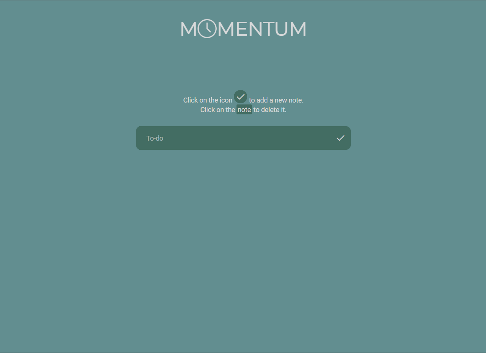

 
# Momentum - To-Do List Website 
Momentum is a simple and efficient to-do list website designed to help you stay organized and productive. With its intuitive user interface and straightforward features, you can easily manage your tasks and stay on top of your daily responsibilities.

 **Table of Contents**
- [Introduction](#introduction)
- [Features](#features)
- [Usage](#usage)
- [Author](#author)

## Introduction

Momentum provides a clean and user-friendly interface for managing your to-do items. It enables you to quickly add tasks, mark them as done, and remove completed tasks. The minimalist design ensures that you focus on your tasks without unnecessary distractions.

 

## Features

- **Add New Tasks:** Click on the "done" icon to add a new task to your to-do list.
- **Remove Tasks:** Click on a task to delete it from the list.
- **Keep tasks saved:** When reloading the page, your notes are saved.
- **Responsive Design:** The website is responsive and adapts to various screen sizes.

## Usage

1. Access the [Momentum website](https://majufacirolli.github.io/momentum/) using your preferred web browser.
2. Click on the "done" icon to add a new task. Enter the task description in the input field.
3. Click on an existing task to mark it as completed/delete it from the list.

## Author

Designed and developed by Maria Julia Facirolli
- [LinkedIn](https://www.linkedin.com/in/mariajuliafacirolli/)
- [GitHub Profile](https://github.com/MajuFacirolli)

> Contributions to Momentum are welcome! If you find any issues or have suggestions for improvements, feel free to create a pull request. Please ensure that your code follows the existing coding style and conventions.
